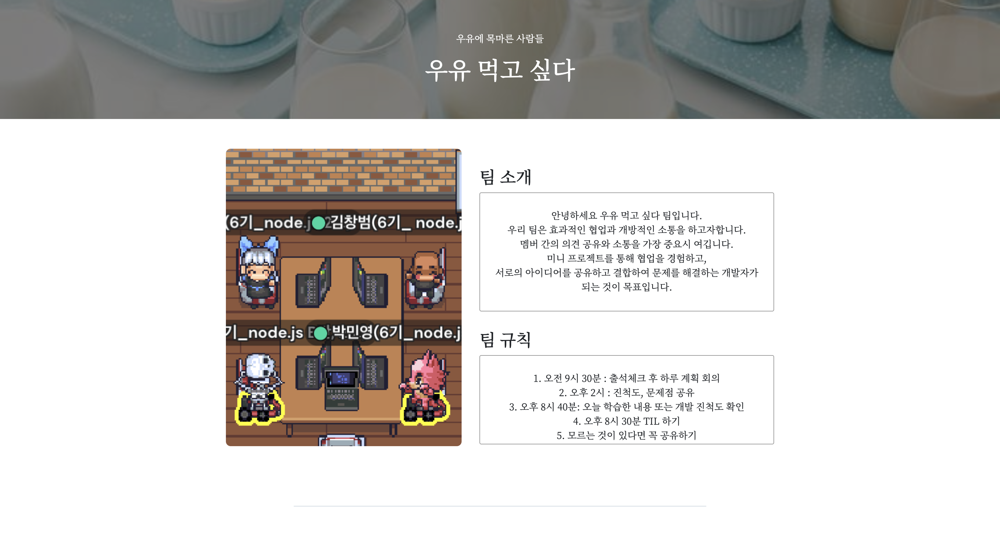
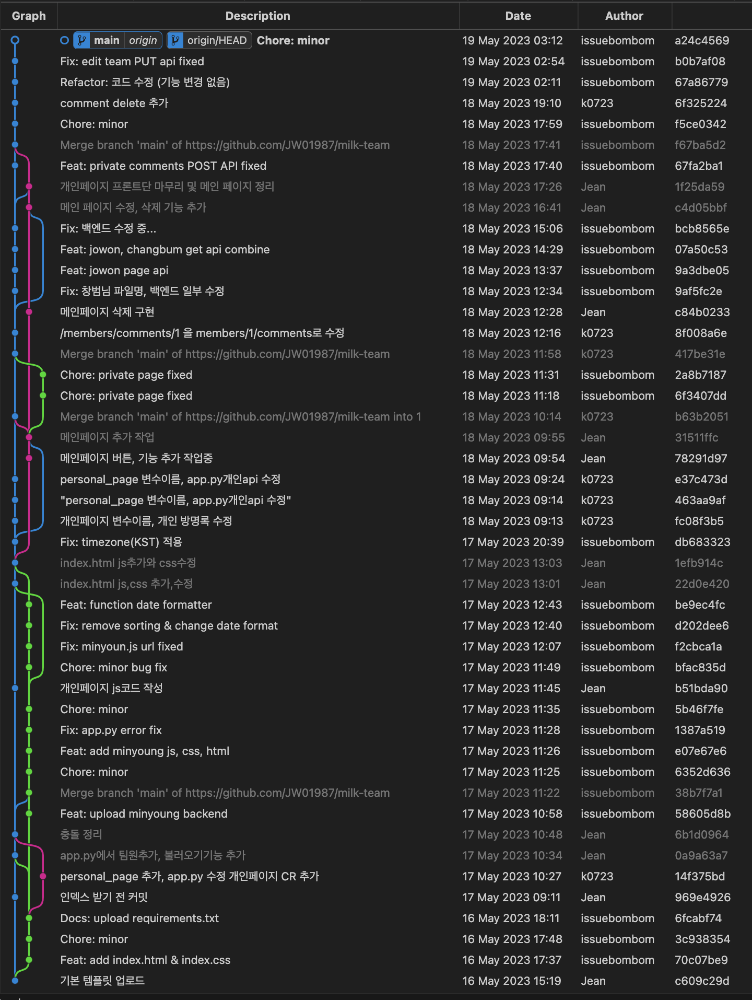

# 🥛 우유 먹고 싶다 프로젝트 발표
## 팀소개

팀명: 우유 먹고 싶다 (2조)  
팀원: 김창범(팀장), 박민영, 박채원, 한조원

## 프로젝트 목표
- 팀 소개 페이지 만들기

## 프로젝트 개요
- 웹개발 종합반 강의 내용을 기반으로 `개별 소개 페이지`를 각자 제작
- Git 협업을 통한 개발

- `팀 페이지`를 메인 페이지로 만들어 `개별 소개 페이지와 연동`
- mongoDB `데이터베이스 통합`
- 개별 소개 페이지의 `API 통합`
  
---
## 사이트 구경하기

---
## 주요 기능 살펴보기
> 수정 기능  
삭제 기능  
ObjectId 타입 이슈  
API 통합  
댓글 업로드 시간 기록  
댓글 입력 제한 


### 수정 기능
수정 기능은 `신규 생성 틀을 재활용`합니다.
1. 수정하려는 데이터의 정보를 DB에서 가져온다.
2. 신규 생성란에 가져온 값을 채운다.
3. 수정 버튼을 통해 PUT 요청을 보낸다.
```python
@app.route("/members/update", methods=["PUT"])
def member_update():
    name_receive = request.get_json()["name"]
    img_receive = request.get_json()["img"]
    comment_receive = request.get_json()["comment"]
    member_id = request.get_json()["memberid"]

    result = db.team.update_one(
        {"id": member_id},
        {
            "$set": {
                "name": name_receive,
                "img": img_receive,
                "comment": comment_receive,
            }
        },
    )

    return "", 204
```

### 삭제 기능
```python
from bson.objectid import ObjectId

@app.route("/members/<int:member_id>/comments/<string:comment_id>", methods=["DELETE"])
def delete_comments_with_id(member_id, comment_id):
    db.comments.delete_one({"_id": ObjectId(comment_id)})
    return jsonify({"msg": "방명록 삭제 완료!"})
```

### ObjectId 타입 이슈
- mongoDB에서 자동 생성되는 _id의 타입이 문자열이 아니라 ObjectId 라는 타입명을 갖는다.  
- 문자열로 형변환 하기위해 for문을 쓴다.

```python
@app.route("/members/<int:member_id>/comments", methods=["GET"])
def get_comments_with_id(member_id):
    if member_id != 2:
        comments = list(db.comments.find({"member_id": member_id}))
        for obj in comments:
            obj["_id"] = str(obj["_id"])
```

### API 통합
- 개인 소개 페이지가 동일한 GET, POST API를 사용하도록 수정
- 
```python
# Before
@app.route("/members/<int:member_id>/comments", methods=["POST"])
def post_comments_with_id(member_id):
		nickname = request.form["nickname"]
    password = request.form["password"]
    comment = request.form["comment"]

		post = {
        "nick_name": nickname,
        "comment": comment,
        "password": password,
        "upload_time": now,
    }

    db.comments.insert_one(post)

		return jsonify({"msg": "방명록 작성 완료!"})
```
```python
# After
@app.route("/members/<int:member_id>/comments", methods=["POST"])
def post_comments_with_id(member_id):
    data = {}
    data["member_id"] = member_id

    for key, value in request.form.items():
        if key == "member_id":  # formData에 들어간 member_id가 str로 담기므로 제외함
            continue
        data[key] = value

		db.comments.insert_one(data)
		
		return jsonify({"msg": "방명록 작성 완료!"})
```

### 댓글 업로드 시간 기록
- 매 댓글이 등록될 때 마다 접수된 시간을 함께 기록
```python
from datetime import datetime, timezone, timedelta

kst = timezone(timedelta(hours=9))
    now = datetime.now(tz=kst)  # 한국 기준 현재시각을 출력합니다.
    data["upload_time"] = now
    db.comments.insert_one(data)

'''
mongoDB insert
-> 2023-05-18T08:27:43.754+00:00

mongoDB find
-> "Thu, 18 May 2023 08:27:43 GMT"
'''
```
- 자바스크립트로 다시 불러오는 순간 시간 표기 형식이 변한다.

```javascript
function dateFormatter(dateString) {
  const inputDate = new Date(dateString);
  const year = inputDate.getFullYear();
  const month = String(inputDate.getMonth() + 1).padStart(2, "0");
  const day = String(inputDate.getDate()).padStart(2, "0");
  const hours = String(inputDate.getHours()).padStart(2, "0");
  const minutes = String(inputDate.getMinutes()).padStart(2, "0");
  const seconds = String(inputDate.getSeconds()).padStart(2, "0");
  const outputDateString = `${year}-${month}-${day} ${hours}:${minutes}:${seconds}`;
  return outputDateString
};

>> "2023-05-18 08:27:43"
```
>`TIP`  
자바스크립트의 new Date 객체를 통해 문자열 시간 데이터를 받을 경우 시간이 변동될 수 있습니다. 이를 예뱅하기 위해 KST 설정이 필요합니다.

### 댓글 입력 제한
`inputChecker` 함수를 통해 빈칸 입력을 방지합니다.
```javascript
let formData = new FormData();
  formData.append("nick_name", inputChecker("닉네임", $("#nickname").val()));
  formData.append("password", inputChecker("비밀번호", $("#password").val()));
  formData.append("comment", inputChecker("코멘트", $("#comment").val()));
```
```javascript
function inputChecker(target, content) {
  const trimString = content.trim()
  if (trimString.length === 0) {
    alert(`${target}을(를) 입력하세요.`);
    throw new Error(`${target}을(를) 입력하지 않았습니다.`);
  } else {
    return content
  };
};
```

## 프로젝트 과정에서 어려웠던 점
- API 명세가 초기에 계획했던 것에서 계속 변경된 점
- html, css코드가 많아지면서 읽기 어려움, 특히 css를통한 프론트 디자인이 맘대로 안됨
- 동기/비동기 이벤트와 관련해서 이해가 잘 되지 않았음
- 디버깅 속도가 느리다고 생각함 (디버깅에 너무 많은 시간이 할애될 때 매우 속상함)
- mongoDB의 id값이 ObjectId 타입으로 되어 있어 빼고 넣을 때 마다 형변환이 필요하다는 점을 깨달음. 데이터베이스에서 데이터를 다룰 시 타입 문제에서 애를 먹었다.
- 수정 기능에서 모달 구현을 하고 싶었는데 어려워서 포기했다. (프론트 디자인 구현에 익숙하지 않음)
- 페이지네이션 구현 아이디어를 내는 과정이 힘들었음
- 각자 만든 GET, POST Flask API를 하나로 합치는 과정

## 정리
매 순간순간이 새로운 도전이었고, 배운 것을 그대로 써먹는 것에서 더 나아가 프로그램을 구현하는 과정을 학습할 수 있는 시간이었고, 무엇보다 Github으로 협업을 경험할 수 있어서 개발자가 된 마냥 뿌듯했다.