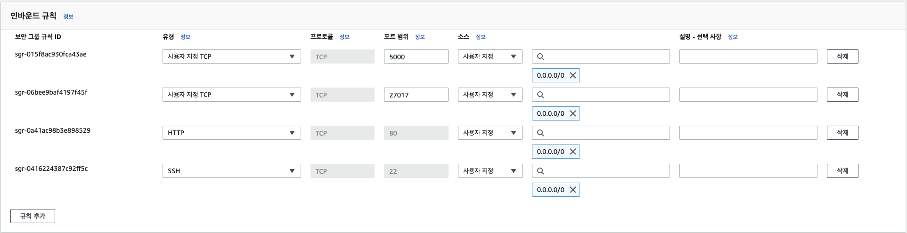

# 🥛 우유 먹고 싶다 프로젝트 발표
## 팀소개

팀명: 우유 먹고 싶다 (2조)  
팀원: 김창범(팀장), 박민영, 박채원, 한조원

## 프로젝트 목표
- 팀 소개 페이지 만들기

## 프로젝트 개요
- 웹개발 종합반 강의 내용을 기반으로 `개별 소개 페이지`를 각자 제작
- Git 협업을 통한 개발

- `팀 페이지`를 메인 페이지로 만들어 `개별 소개 페이지와 연동`
- mongoDB `데이터베이스 통합`
- 개별 소개 페이지의 `API 통합`
- 배포 (http://www.우유먹고싶다.메인.한국)
  
---
## 사이트 구경하기
- 시연 영상 (https://youtu.be/i08qF3R_GBk)
---
## 주요 기능 살펴보기
> 수정 기능  
삭제 기능  
ObjectId 타입 이슈  
API 통합  
댓글 업로드 시간 기록  
댓글 입력 제한  
페이지네이션


### 1. 수정 기능
수정 기능은 `신규 생성 틀을 재활용`합니다.
1. 수정하려는 데이터의 정보를 DB에서 가져온다.
2. 신규 생성란에 가져온 값을 채운다.
3. 수정 버튼을 통해 PUT 요청을 보낸다.
```python
@app.route("/members/update", methods=["PUT"])
def member_update():
    name_receive = request.get_json()["name"]
    img_receive = request.get_json()["img"]
    comment_receive = request.get_json()["comment"]
    member_id = request.get_json()["memberid"]

    result = db.team.update_one(
        {"id": member_id},
        {
            "$set": {
                "name": name_receive,
                "img": img_receive,
                "comment": comment_receive,
            }
        },
    )

    return "", 204
```

### 2. 삭제 기능
```python
from bson.objectid import ObjectId

@app.route("/members/<int:member_id>/comments/<string:comment_id>", methods=["DELETE"])
def delete_comments_with_id(member_id, comment_id):
    db.comments.delete_one({"_id": ObjectId(comment_id)})
    return jsonify({"msg": "방명록 삭제 완료!"})
```

### ObjectId 타입 이슈
- mongoDB에서 자동 생성되는 _id의 타입이 문자열이 아니라 ObjectId 라는 타입명을 갖는다.  
- 문자열로 형변환 하기위해 for문을 쓴다.

```python
@app.route("/members/<int:member_id>/comments", methods=["GET"])
def get_comments_with_id(member_id):
    comments = list(db.comments.find({"member_id": member_id}))
    for obj in comments:
        obj["_id"] = str(obj["_id"])
```

### 3. API 통합
- 개인 소개 페이지가 동일한 GET, POST API를 사용하도록 수정
```python
# Before
@app.route("/members/<int:member_id>/comments", methods=["POST"])
def post_comments_with_id(member_id):
    nickname = request.form["nickname"]
    password = request.form["password"]
    comment = request.form["comment"]

    post = {
        "nick_name": nickname,
        "comment": comment,
        "password": password,
        "upload_time": now,
    }

    db.comments.insert_one(post)

    return jsonify({"msg": "방명록 작성 완료!"})
```
```python
# After
@app.route("/members/<int:member_id>/comments", methods=["POST"])
def post_comments_with_id(member_id):
    data = {}
    data["member_id"] = member_id

    for key, value in request.form.items():
        if key == "member_id":  # formData에 들어간 member_id가 str로 담기므로 제외함
            continue
        data[key] = value

    db.comments.insert_one(data)

    return jsonify({"msg": "방명록 작성 완료!"})
```

### 4. 댓글 업로드 시간 기록
- 매 댓글이 등록될 때 마다 접수된 시간을 함께 기록
```python
from datetime import datetime, timezone, timedelta

kst = timezone(timedelta(hours=9))
now = datetime.now(tz=kst)  # 한국 기준 현재시각을 출력합니다.
data["upload_time"] = now
db.comments.insert_one(data)

'''
mongoDB insert
-> 2023-05-18T08:27:43.754+00:00

mongoDB find
-> "Thu, 18 May 2023 08:27:43 GMT"
'''
```
- 자바스크립트로 다시 불러오는 순간 시간 표기 형식이 변한다.

```javascript
function dateFormatter(dateString) {
  const inputDate = new Date(dateString);
  const year = inputDate.getFullYear();
  const month = String(inputDate.getMonth() + 1).padStart(2, "0");
  const day = String(inputDate.getDate()).padStart(2, "0");
  const hours = String(inputDate.getHours()).padStart(2, "0");
  const minutes = String(inputDate.getMinutes()).padStart(2, "0");
  const seconds = String(inputDate.getSeconds()).padStart(2, "0");
  const outputDateString = `${year}-${month}-${day} ${hours}:${minutes}:${seconds}`;
  return outputDateString
};

>> "2023-05-18 08:27:43"
```
>`TIP`  
자바스크립트의 new Date 객체를 통해 문자열 시간 데이터를 받을 경우 시간이 변동될 수 있습니다. 이를 예뱅하기 위해 KST 설정이 필요합니다.

### 5. 댓글 입력 제한
`inputChecker` 함수를 통해 빈칸 입력을 방지합니다.
```javascript
let formData = new FormData();
  formData.append("nick_name", inputChecker("닉네임", $("#nickname").val()));
  formData.append("password", inputChecker("비밀번호", $("#password").val()));
  formData.append("comment", inputChecker("코멘트", $("#comment").val()));
```
```javascript
function inputChecker(target, content) {
  const trimString = content.trim()
  if (trimString.length === 0) {
    alert(`${target}을(를) 입력하세요.`);
    throw new Error(`${target}을(를) 입력하지 않았습니다.`);
  } else {
    return content
  };
};
```

## 프로젝트 과정에서 어려웠던 점
- API 명세가 초기에 계획했던 것에서 계속 변경된 점
- html, css코드가 많아지면서 읽기 어려움, 특히 css를통한 프론트 디자인이 맘대로 안됨
- 동기/비동기 이벤트와 관련해서 이해가 잘 되지 않았음
- 디버깅 속도가 느리다고 생각함 (디버깅에 너무 많은 시간이 할애될 때 매우 속상함)
- mongoDB의 id값이 ObjectId 타입으로 되어 있어 빼고 넣을 때 마다 형변환이 필요하다는 점을 깨달음. 데이터베이스에서 데이터를 다룰 시 타입 문제에서 애를 먹었다.
- 수정 기능에서 모달 구현을 하고 싶었는데 어려워서 포기했다. (프론트 디자인 구현에 익숙하지 않음)
- 페이지네이션 구현 아이디어를 내는 과정이 힘들었음
- 각자 만든 GET, POST Flask API를 하나로 합치는 과정

## 정리
매 순간순간이 새로운 도전이었고, 배운 것을 그대로 써먹는 것에서 더 나아가 프로그램을 구현하는 과정을 경험하는 시간이 좋았다.  
무엇보다 Github으로 협업을 경험할 수 있어서 개발자가 된 마냥 뿌듯했다.

---
# Appendix
## AWS EC2에서 mongoDB 데이터베이스 생성하기
install guide: (https://www.mongodb.com/docs/manual/tutorial/install-mongodb-on-ubuntu/)

📌 AWS EC2 Ubuntu 22.04 LTS ("Jammy") 버전을 기준으로 작성되었습니다.

### [ubuntu initialize]
EC2 ubuntu에는 기본적으로 파이썬 3.10 버전이 설치되어 있습니다.
```bash
# UTC to KST
sudo ln -sf /usr/share/zoneinfo/Asia/Seoul /etc/localtime

# python3 -> python
sudo update-alternatives --install /usr/bin/python python /usr/bin/python3 10

# pip3 -> pip
sudo apt-get update
sudo apt-get install -y python3-pip
pip3 --version
sudo update-alternatives --install /usr/bin/pip pip /usr/bin/pip3 1

# port forwarding
sudo iptables -t nat -A PREROUTING -i eth0 -p tcp --dport 80 -j REDIRECT --to-port 5000
```

### [install MongoDB]
**Import the public key used by the package management system**
```bash
sudo apt-get install gnupg
```
```bash
curl -fsSL https://pgp.mongodb.com/server-6.0.asc | \
   sudo gpg -o /usr/share/keyrings/mongodb-server-6.0.gpg \
   --dearmor
```

**Create a list file for MongoDB**
>해당 명령은 curl을 사용하여 MongoDB의 공개 키를 다운로드하고, 다운로드된 공개 키를 GPG(GNU Privacy Guard)를 사용하여 디코딩 및 변환하는 명령입니다.  
상세한 설명은 다음과 같습니다:  
curl -fsSL https://pgp.mongodb.com/server-6.0.asc: curl을 사용하여 https://pgp.mongodb.com/server-6.0.asc에서 MongoDB 서버 6.0의 공개 키를 다운로드합니다.  
-fsSL 옵션은 실패 시 오류 메시지를 표시하지 않고, SSL 인증서 검증을 비활성화하고, 서버로 리디렉션을 따라가도록 설정합니다.  
sudo gpg -o /usr/share/keyrings/mongodb-server-6.0.gpg --dearmor: 다운로드한 공개 키를 GPG를 사용하여 /usr/share/keyrings/mongodb-server-6.0.gpg 파일로 디코딩하고 변환합니다.  
--dearmor 옵션은 GPG 키를 바이너리 형식에서 ASCII 형식으로 변환합니다.  
이 명령은 MongoDB의 공개 키를 다운로드하여 시스템에 등록하는 과정을 수행합니다. 이를 통해 시스템에서 MongoDB의 패키지를 검증할 수 있게 됩니다.
```bash
echo "deb [ arch=amd64,arm64 signed-by=/usr/share/keyrings/mongodb-server-6.0.gpg ] https://repo.mongodb.org/apt/ubuntu jammy/mongodb-org/6.0 multiverse" | sudo tee /etc/apt/sources.list.d/mongodb-org-6.0.list
```

**Reload local package database**
```bash
sudo apt-get update
```
**Install the MongoDB packages.**
```bash
sudo apt-get install -y mongodb-org
```

### [EC2 보안그룹 - 인바운드 규칙 수정]
> MongoDB Port:27017  


### [Start MongoDB]
>mongodb를 실행하고 status를 통해 연결이 잘 되었는지 확인합니다.
```bash
sudo service mongod start
sudo service mongod status
```
정상 작동 시 status 결과에서 Active 란에 active(초록색)이 들어와야 합니다.
```bash
● mongod.service - MongoDB Database Server
     Loaded: loaded (/lib/systemd/system/mongod.service; enabled; vendor preset: enabled)
     Active: active (running) since Fri 2023-05-19 11:54:37 KST; 4h 28min ago
       Docs: https://docs.mongodb.org/manual
   Main PID: 5501 (mongod)
     Memory: 120.6M
        CPU: 1min 4.443s
     CGroup: /system.slice/mongod.service
             └─5501 /usr/bin/mongod --config /etc/mongod.conf

May 19 11:54:37 ip-172-31-32-40 systemd[1]: mongod.service: Deactivated successfully.
May 19 11:54:37 ip-172-31-32-40 systemd[1]: Stopped MongoDB Database Server.
May 19 11:54:37 ip-172-31-32-40 systemd[1]: mongod.service: Consumed 3.345s CPU time.
May 19 11:54:37 ip-172-31-32-40 systemd[1]: Started MongoDB Database Server.
May 19 11:54:37 ip-172-31-32-40 mongod[5501]: {"t":{"$date":"2023-05-19T02:54:37.966Z"},"s":"I",  "c":"CONTROL",  "id":7484500, "ctx":"-","msg":"Environment variable MONGODB_CONFIG_OVERRIDE_NOFORK == 1, overriding \"processManagement.fork\" to false"}
```
>💡 **TIP**  
어떠한 문제로 인해 `mongod.service: Failed with result 'exit-code'.`와 같은 경고가 뜨면서 Active 되지 않을 경우 `/tmp/mongodb-27017.sock` 이 경로의 파일을 삭제해 볼것을 추천합니다.

### [Set Database]
`/etc/mongod.conf` 파일을 열어서 아래와 같이 수정합니다.
1. bindIp 0.0.0.0 수정
2. security 활성화 및 `authorization: enabled` 입력
```bash
# network interfaces
net:
  port: 27017
  bindIp: 0.0.0.0

security:
  authorization: enabled
```

MongoDB에 접속하여 유저 생성을 합니다.
```bash
# MongoDB 접속
mongosh
```
```bash
# 어드민 계정 접속
use admin
```
```bash
# 외부 접속용 계정 생성
db.createUser({user: "input", pwd: "input", roles:["root"]});
```
admin 계정으로 사용자 계정을 생성합니다. user 란과 pwd란의 "input"을 원하시는 값으로 변경합니다. 그리고 반드시 기억해야 합니다.  
roles는 사용자 권한설정을 의미합니다. (root 권한은 뭐든지 할 수 있음을 뜻합니다.)
```bash
#mongoDB 나오기
exit
```
```bash
#mongoDB 재시작
service mongod restart
```

### python으로 DB 접속 테스트해보기
아래 코드에서 user와 pwd, 그리고 ec2에 할당된 IP주소를 입력합니다.  
위 코드가 정상작동한다면 `[{'_id': ObjectId('6467297316acc6e3d44187b9'), 'test': 1234}]`와 같이 데이터가 잘 출력되어야 합니다. 이제 해당 서버는 데이터베이스 저장소가 되었고 기본적으로 `/var/lib/mongodb`경로에 데이터가 저장됩니다.
```python
from pymongo import MongoClient

def run():
    client = MongoClient('mongodb://<user>:<pwd>@<ec2 Public IPv4>', 27017)

    db = client.test
    db.testcollection.insert_one({'test': 1234}) 

    test_data = list(db.testcollection.find({}))
    print(test_data)

if __name__ == "__main__":
    run()
```